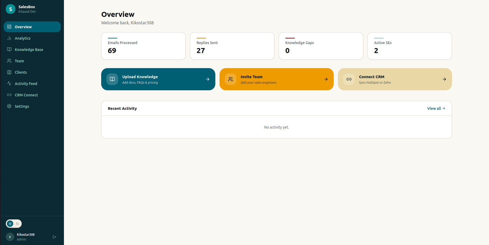
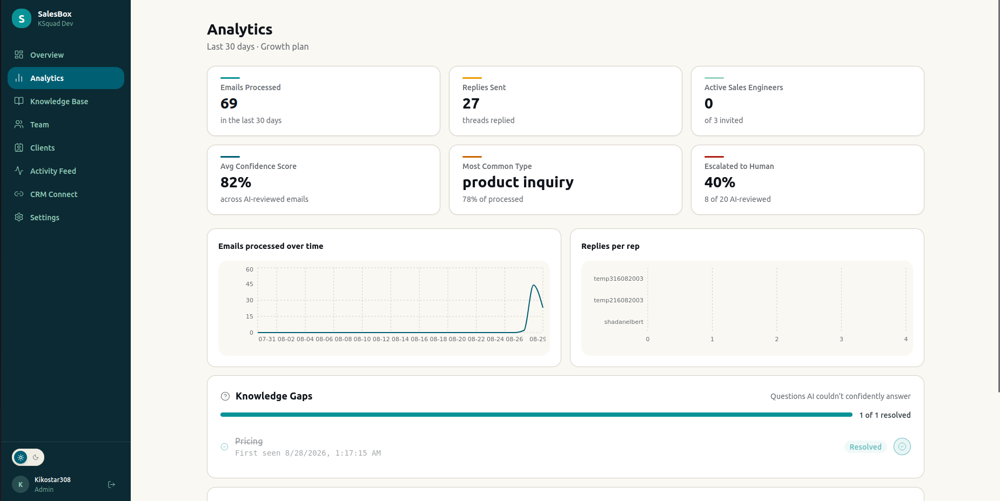
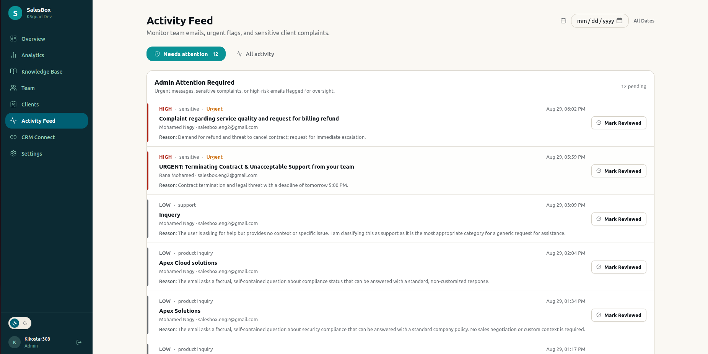
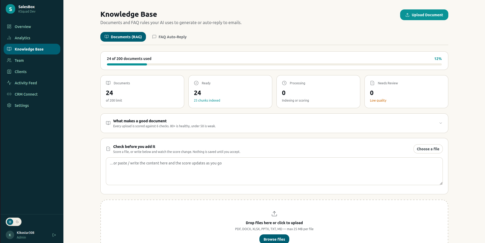
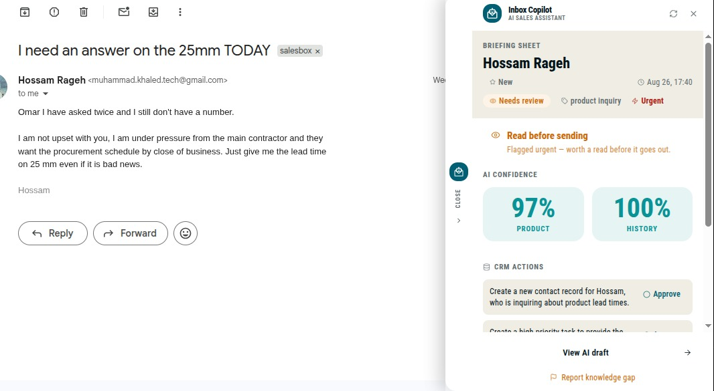
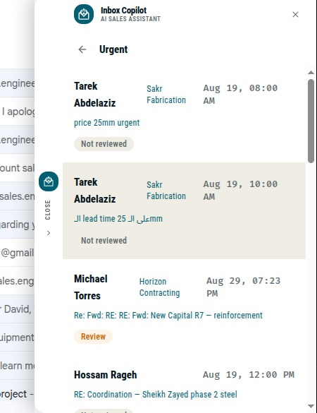
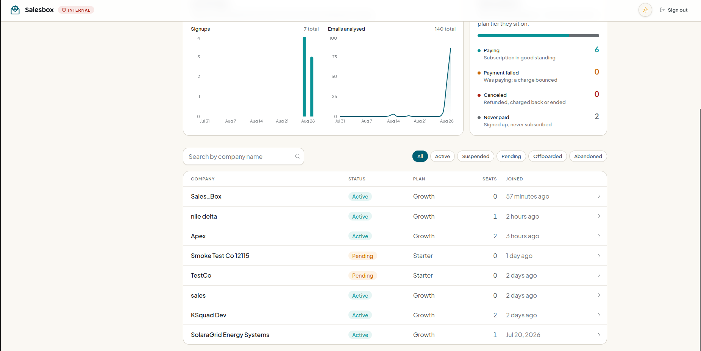

<div id="top" align="center">

```
██╗███╗   ██╗██████╗  ██████╗ ██╗  ██╗    ███████╗ █████╗ ██╗     ███████╗███████╗
██║████╗  ██║██╔══██╗██╔═══██╗╚██╗██╔╝    ██╔════╝██╔══██╗██║     ██╔════╝██╔════╝
██║██╔██╗ ██║██████╔╝██║   ██║ ╚███╔╝     ███████╗███████║██║     █████╗  ███████╗
██║██║╚██╗██║██╔══██╗██║   ██║ ██╔██╗     ╚════██║██╔══██║██║     ██╔══╝  ╚════██║
██║██║ ╚████║██████╔╝╚██████╔╝██╔╝ ██╗    ███████║██║  ██║███████╗███████╗███████║
╚═╝╚═╝  ╚═══╝╚═════╝  ╚═════╝ ╚═╝  ╚═╝    ╚══════╝╚═╝  ╚═╝╚══════╝╚══════╝╚══════╝
```

<h3>AI-Powered Sales Reply Assistant for Gmail</h3>

[](https://react.dev/)
[](https://www.typescriptlang.org/)
[](https://tailwindcss.com/)
[](https://vite.dev/)
[](https://developer.chrome.com/docs/extensions/mv3/)
[](https://pnpm.io/)

</div>

---

## About The Project

**Inbox Sales Copilot** is an AI-powered sales assistant that helps sales engineers respond to emails faster and smarter. The frontend is a **pnpm monorepo** containing two applications:

- **Dashboard** — A full-featured admin SPA for managing tenants, knowledge bases, CRM data, analytics, and AI pipeline settings.
- **Chrome Extension** — A Gmail sidebar panel (Manifest V3) that shows AI-generated reply suggestions, contact briefs, and confidence scores in real time.

### Key Features

- **AI Reply Suggestions** — Drafts generated from your knowledge base, with hallucination detection
- **Analytics Dashboard** — Email volume, response times, AI accuracy, and confidence breakdowns
- **Multi-Tenant Platform** — Isolated workspaces with role-based access and Stripe billing
- **Gmail Integration** — Chrome Extension injects a sidebar panel directly into Gmail via Shadow DOM
- **Smart Routing** — Emails triaged as Auto-worthy / Needs Review / Manual Reply with reason codes
- **Knowledge Base Management** — Upload, chunk, and embed documents for RAG retrieval
- **Subscription Paywall** — Stripe-powered billing with fail-closed route guards
- **Dark Mode** — Full dark theme with CSS custom properties

---

## Screenshots

<div align="center">

| Overview | Analytics |
| -------- | --------- |
|  |  |

| Activity Feed | Knowledge Base |
| ------------- | -------------- |
|  |  |

| Extension — Briefing Sheet | Extension — Email History |
| -------------------------- | ------------------------ |
|  |  |

| Platform Admin — Tenants |
| ------------------------ |
|  |

</div>

---

## Getting Started

### Prerequisites

- **Node.js** >= 22.13.0
- **pnpm** 11.9.0 (managed via `corepack`)
- **Google Chrome** (for extension development)

### Installation

1. **Clone the repository**

   ```bash
   git clone <repo-url>
   cd frontend
   ```

2. **Enable corepack & install dependencies**

   ```bash
   corepack enable
   pnpm install
   ```

3. **Set up environment variables**

   ```bash
   cp apps/dashboard/.env.example apps/dashboard/.env
   ```

   Edit `.env` with your values:

   ```env
   VITE_API_BASE_URL=http://localhost:3000
   VITE_STRIPE_PUBLISHABLE_KEY=pk_test_...
   VITE_EXTENSION_DOWNLOAD_URL=              # optional
   VITE_EXTENSION_VERSION=                    # optional
   ```

### Running the Dashboard

```bash
pnpm dev
```

The dashboard will be available at `http://localhost:5173`.

### Building the Chrome Extension

```bash
pnpm dev:extension
```

**To load in Chrome:**

1. Open `chrome://extensions/`
2. Enable **Developer mode** (top right toggle)
3. Click **Load unpacked**
4. Select the `apps/extension/dist` folder
5. Open [Gmail](https://mail.google.com/) — the sidebar panel will appear

### Production Build

```bash
pnpm build
```

---

## Project Structure

```
frontend/
├── package.json                # Root workspace configuration
├── pnpm-workspace.yaml         # Workspace packages definition
├── Dockerfile                  # Multi-stage build (Node 22 → nginx:alpine)
├── nginx.conf                  # SPA routing configuration
├── .github/
│   └── workflows/
│       ├── cicd-dev.yml        # develop → Docker Hub → EC2 (dev)
│       └── cicd-prod.yml       # main → Docker Hub → EC2 (prod)
├── apps/
│   ├── dashboard/              # Admin Dashboard SPA
│   │   ├── src/
│   │   │   ├── components/     # Reusable UI components
│   │   │   ├── hooks/          # Custom React hooks (queries, mutations)
│   │   │   ├── lib/            # Utilities, API client, formatters
│   │   │   ├── pages/          # Route-level page components
│   │   │   ├── store/          # Zustand state stores
│   │   │   └── data/           # Static data (pricing tiers, etc.)
│   │   ├── vite.config.ts      # Vite config with API proxy (14 routes)
│   │   └── .env.example        # Environment variables template
│   └── extension/              # Gmail Chrome Extension (MV3)
│       ├── src/
│       │   ├── screens/        # Panel screens (Briefing, Draft, CRM)
│       │   ├── components/     # Extension-specific UI
│       │   ├── lib/            # Routing, confidence, API client
│       │   ├── background/     # Service worker (auth, messaging)
│       │   └── content/        # Content script (Shadow DOM injection)
│       ├── manifest.json       # Chrome MV3 manifest
│       └── vite.config.ts      # CRXJS plugin config
└── packages/
    └── shared/                 # Shared package (@inbox-sales/shared)
        └── src/
            └── api-client.ts
```

---

## Technical Highlights

### Architecture Patterns

- **Monorepo** — pnpm workspaces with shared dependencies and consistent tooling
- **Dual-Client Architecture** — Dashboard and Extension have independent API clients, auth flows, and storage strategies
- **Fail-Closed Paywall** — `ProtectedRoute` is the default; `ProtectedRouteNoPaywall` is the explicit exception
- **Identity Isolation** — Platform JWT and Tenant JWT never cross — separate clients, separate storage keys

### Chrome Extension — Shadow DOM Isolation

```typescript
// Content script injects an isolated Shadow DOM into Gmail
const host = document.createElement('inbox-sales-panel');
const shadow = host.attachShadow({ mode: 'open' });
```

- Styles are fully encapsulated — Gmail CSS cannot leak in
- JWT stored in `chrome.storage.local` (invisible to page context)
- Network calls go through the background service worker
- Only `messageId` and `accountEmail` are read from Gmail — **never email content**

### Smart Routing & Hallucination Veto

```typescript
// Client-side veto — a hallucinated draft is never sendable
if (scores.hasHallucination) return 'red';
```

The extension enforces a client-side hallucination veto **on top of** the backend's Supervisor label. Even if a version-skewed backend sends a green label for a hallucinated draft, the one-click Send screen is blocked.

### API Client — Auto-Logout on Auth Failures

```
401 on normal route  → clearSession() + redirect to /signin
401 on credential route → show error (no redirect — prevents white screen)
403 + ACCOUNT_INACTIVE → clearSession() + redirect
Same logic on XHR uploads — explicitly duplicated, not shared
```

### Vite Proxy — 14 Backend Routes

The dashboard proxies all API traffic through Vite in development:

```
/platform, /auth, /tenants, /clients, /emails,
/knowledge-base, /analytics, /external-content,
/ai, /health, /queue, /gmail, /payments, /stripe
```

All pointing to `VITE_API_BASE_URL` (default `http://localhost:3000`).

---

## Tech Stack

### Core

| Technology | Version | Purpose |
| ---------- | ------- | ------- |
| React | 19.2.7 | UI framework |
| TypeScript | ~6.0.2 | Type safety |
| Tailwind CSS | 4.3.3 | Utility-first styling (CSS `@theme`) |
| Vite | 8.1.5 | Build tool & dev server |

### State & Data

| Technology | Version | Purpose |
| ---------- | ------- | ------- |
| Zustand | 5.0.14 | Client state management |
| TanStack React Query | 5.101.2 | Server state & caching |
| React Router DOM | 7.18.2 | SPA routing |

### UI & Visualization

| Technology | Version | Purpose |
| ---------- | ------- | ------- |
| Recharts | 3.9.2 | Analytics charts & graphs |
| Lucide React | 1.24.0 | Icon system (dashboard) |

### Testing & Quality

| Technology | Version | Purpose |
| ---------- | ------- | ------- |
| Vitest | 4.1.10 | Unit & integration testing |
| oxlint | 1.71.0 | Fast Rust-based linter |

### Extension

| Technology | Version | Purpose |
| ---------- | ------- | ------- |
| @crxjs/vite-plugin | 2.0.0-beta.33 | Chrome Extension builds with Vite |
| Chrome MV3 | — | Manifest V3 (secure, modern) |
| Shadow DOM | — | Style isolation in Gmail |

### Infrastructure

| Technology | Purpose |
| ---------- | ------- |
| pnpm 11.9.0 | Monorepo package management |
| Docker (nginx:alpine) | Production container |
| GitHub Actions | CI/CD (lint, build, Trivy scan, deploy) |
| Docker Hub | Container registry |
| AWS EC2 | Production hosting |

---

## Design System

The project uses **Tailwind CSS v4** with CSS-native configuration — no `tailwind.config.js` needed.

### Theme Configuration

Design tokens are defined via `@theme` in each app's `index.css`:

```css
@theme {
  --color-primary: #6C5CE7;
  --color-surface-primary: #FFFFFF;
  --color-surface-secondary: #F8F9FA;
  --color-text-primary: #1A1A2E;
  /* ... */
}
```

### Dark Mode

Full dark theme via CSS custom properties, toggled by `data-theme="dark"` on the root element. Every surface, text, and border color uses semantic tokens.

---

## Deployment

### Docker Build

```dockerfile
# Multi-stage: Node 22 Alpine (build) → nginx:alpine (serve)
FROM node:22-alpine AS builder
# ... install deps, build dashboard
FROM nginx:alpine
COPY --from=builder /app/apps/dashboard/dist /usr/share/nginx/html
EXPOSE 80
```

### CI/CD Pipeline

```
push to develop → Lint → Build → Trivy Security Scan → Docker Build → Push to Docker Hub → Deploy to EC2 (dev)
push to main    → Lint → Build → Trivy Security Scan → Docker Build → Push to Docker Hub → Deploy to EC2 (prod)
```

Both pipelines use:
- `pnpm install --frozen-lockfile` — reproducible installs
- `corepack enable` — pinned pnpm version
- Trivy pinned on **SHA** (not tag) — supply chain protection
- Docker images tagged with `${{ github.sha }}` — immutable deployments

---

## Available Scripts

| Script | Description |
| ------ | ----------- |
| `pnpm dev` | Start the dashboard dev server |
| `pnpm dev:extension` | Start the extension dev build |
| `pnpm build` | Production build for all apps |
| `pnpm test` | Run all tests (Vitest) |
| `pnpm test:watch` | Run tests in watch mode |
| `pnpm lint` | Lint all code (oxlint) |

---

## Team

<table>
  <tr>
    <td align="center">
      <a href="https://github.com/Karim-308">
        <br />
        <sub><b>Karim Ibrahim</b></sub>
      </a>
    </td>
    <td align="center">
      <a href="https://github.com/Ged0oo">
        <br />
        <sub><b>Mohamed Nagy</b></sub>
      </a>
    </td>
    <td align="center">
      <a href="https://github.com/muhammad-khaled-tech">
        <br />
        <sub><b>Mohamed Khaled</b></sub>
      </a>
    </td>
  </tr>
  <tr>
    <td align="center">
      <a href="https://github.com/RanaMohamed24">
        <br />
        <sub><b>Rana Mohamed</b></sub>
      </a>
    </td>
    <td align="center">
      <a href="https://github.com/SalmaYasserMoselhi">
        <br />
        <sub><b>Salma Yasser</b></sub>
      </a>
    </td>
    <td align="center">
      <a href="https://github.com/Abdulrahman295">
        <br />
        <sub><b>Abdulrahman Ibrahim</b></sub>
      </a>
    </td>
  </tr>
</table>

---

## License

This project is proprietary. All rights reserved.

---

<div align="center">

**Built with love by the Inbox Sales Team**

[back to top](#top)

</div>
