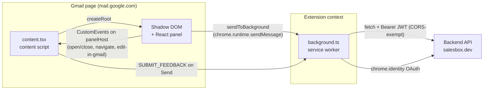
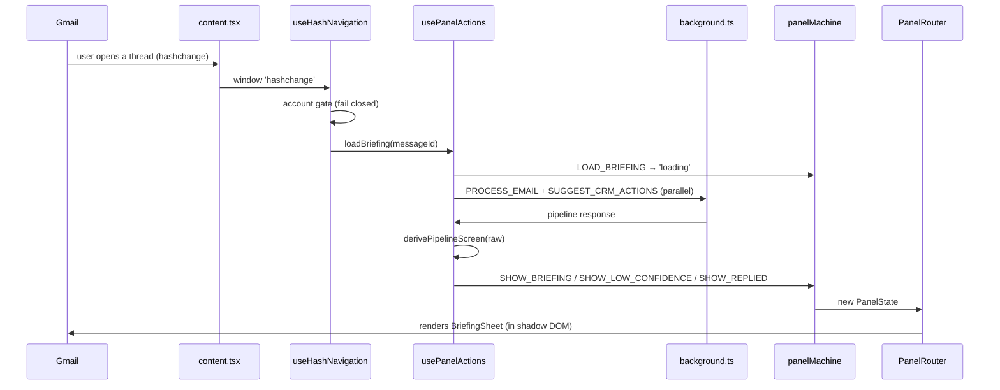

# Inbox Sales Copilot — Extension Architecture & Review Guide

A reading map for the Chrome extension. Read the sections top-to-bottom the first
time; afterwards use the **File reference** as a lookup table. The last section is
a focused checklist for reviewing the current `App.tsx` decomposition refactor.

> This doc is developer documentation only — it is not imported anywhere and does
> not affect the build. Keep it, commit it, or delete it freely.

---

## 1. What this is

A Manifest V3 Chrome extension that injects an AI "sales copilot" panel into
Gmail. When a Sales Engineer (SE) opens a thread, the panel fetches an AI-drafted
reply + confidence briefing from the backend and lets them insert it into Gmail's
compose box. It also shows an inbox overview (category counts) and paused CRM
actions awaiting approval.

Backend base URL: `VITE_API_BASE_URL` (defaults to `https://salesbox.dev`).

---

## 2. The three execution contexts

A Chrome extension is not one program — it's three, in different sandboxes. Almost
every "why is this here" question resolves to *which context needs it*.



| Context | File | Runs where | Owns |
|---|---|---|---|
| **Content script** | `src/content.tsx` | Inside the Gmail page | Shadow-DOM injection, Gmail layout push, reading the open thread/account from Gmail's DOM, inserting the reply, the one boundary where we touch Gmail's real DOM |
| **Service worker** | `src/background.ts` | Extension background | `chrome.identity` OAuth, every backend `fetch` (declared host permissions make these CORS-exempt), reading the JWT from `chrome.storage` |
| **React panel** | `src/App.tsx` + hooks/screens/components | Inside the shadow root | All UI and app state; talks to the worker via messages and to Gmail via CustomEvents |

**Why the split matters for review:** the panel can *never* call `fetch` to the
backend directly (CORS + no JWT there) and can *never* touch Gmail's DOM directly
(shadow isolation). Every such need is a message or a CustomEvent. If you see the
panel reaching across a boundary any other way, that's a bug.

---

## 3. How a briefing gets on screen (the main lifecycle)

Follow this once with the files open — it exercises most of the codebase.



Key rules encoded along the way:
- **Fail closed on account** — SE data shows *only* when the tab's Google account
  equals the connected `accountEmail`. See `useSessionRehydrate`,
  `useHashNavigation`, and `App.handleExpand`.
- **Routing authority is the backend** — which screen shows (green/yellow/red) is
  the Supervisor's `label`, mapped in `lib/routing.ts`. The old client-side
  threshold in `lib/confidence.ts` is a **legacy fallback only** (used when a
  cached/older response has no label).
- **Race guard** — `briefingInFlightRef` + a monotonic `loadSeqRef` in
  `usePanelActions` stop a stale inbox-overview fetch from clobbering a briefing
  the user is waiting on.

---

## 4. State model

`useReducer(panelReducer)` in `App.tsx` is the single source of truth for *which
screen shows*. `PanelState` is a discriminated union; `PanelRouter` switches on
its `type`.

```
collapsed → auth → loading → overview ⇄ category-list
                              loading → briefing | low-confidence | replied
   any → invalid (wrong account) | revoked (access pulled)
```

- `src/state/panelMachine.ts` — the `PanelState`/`PanelAction` unions + reducer.
- `src/state/session.ts` — typed wrapper over `chrome.storage.local` for the
  persisted session (`jwt`, `tenantId`, `accountEmail`, `cachedInboxStats`).

Everything else — network results, toasts, CRM suggestions — is component/hook
state, not in the reducer.

---

## 5. File reference

Grouped by layer. **Purpose** = what it does; **Why/target** = the design intent
or the trap it guards.

### Entry points & config
| File | Purpose | Why / target |
|---|---|---|
| `manifest.json` | MV3 config: permissions, content script, worker, OAuth client, web-accessible fonts/mascots | Content script matches `mail.google.com`; host permissions make worker `fetch` CORS-exempt |
| `src/content.tsx` | Injects the panel into Gmail via Shadow DOM; pushes Gmail's layout; bridges panel↔Gmail-DOM via CustomEvents | The **only** file allowed to mutate Gmail's real DOM (all inside `syncGmailLayout` + the event handlers) |
| `src/background.ts` | Service worker: OAuth code flow + one handler per backend call | Each `BgRequest` type → one endpoint; reads JWT from storage; returns `{...data, status}` or `{error, status}` |
| `src/main.tsx` | Standalone dev entry (renders `App` at `#root` via `index.html`) | For local `vite dev`/preview only — the real inject path is `content.tsx` |
| `index.html` | Host page for the dev entry | Dev/preview only |

### Composition & app shell
| File | Purpose | Why / target |
|---|---|---|
| `src/App.tsx` | Thin composition root: wires hooks, defines UI-coordination handlers, renders `CollapsedTab` or `PanelRouter` | After the refactor it holds **no** business logic — just wiring + DOM-event handlers |

### Hooks (behavior)
| File | Purpose | Why / target |
|---|---|---|
| `src/hooks/usePanelActions.ts` | All background/data actions: `fetchStats`, `loadBriefing`, `selectCategory`, CRM suggestions + `resolveCrmActions`, `reportGap`, `consumeGraphThreadId` | The app's "action layer." Owns the race guard, `graphThreadId`, and CRM-suggestion lifecycle |
| `src/hooks/useAuthFlow.ts` | The sign-in chain: OAuth code → SE login → `/auth/me` → inbox stats | Isolated so `App` doesn't carry a 60-line async flow |
| `src/hooks/useGmailContext.ts` | Polls Gmail's DOM for the account + open message id (fail-closed, bounded retries) | Gmail mounts async; polling avoids reading `null` too early |
| `src/hooks/useHashNavigation.ts` | On Gmail `hashchange`, decides briefing-vs-overview and reloads (with the account gate) | Gmail is a SPA; URL hash is the navigation signal |
| `src/hooks/useSessionRehydrate.ts` | On mount, restores session and shows the right first screen (cached stats placeholder while refetching) | Runs once (`[]` deps by design) |
| `src/hooks/useAsyncAction.ts` | Generic wrapper: run an async fn, capture errors into a retryable toast | DRY error/toast handling; `run` is stable across renders |

### Routing & rendering
| File | Purpose | Why / target |
|---|---|---|
| `src/screens/PanelRouter.tsx` | Pure switch: `PanelState` + handlers → the right screen | Has an exhaustiveness `never` check so a new panel type won't compile until handled |

### Screens (full-panel views)
| File | Purpose |
|---|---|
| `src/screens/CollapsedTab.tsx` | The edge tab; expands the panel (and doubles as the collapse toggle) |
| `src/screens/AuthScreen.tsx` | Sign-in screen |
| `src/screens/InvalidScreen.tsx` | "Not authorized" (wrong Google account) |
| `src/screens/LoadingScreen.tsx` | Skeleton mirroring the briefing layout |
| `src/screens/InboxOverviewScreen.tsx` | Inbox dashboard: totals, intent breakdown, reviewed breakdown |
| `src/screens/EmailCategoryList.tsx` | The email list for a chosen category |
| `src/screens/BriefingSheet.tsx` | **The product moment** — client card, confidence pills, CRM actions, draft view, "Insert in Gmail", report-gap |
| `src/screens/LowConfidenceScreen.tsx` | Red path — missing-context explanation + manual/insert paths + CRM/report-gap |
| `src/screens/RepliedScreen.tsx` | Thread already replied — short summary |
| `src/screens/RevokedScreen.tsx` | Access revoked terminal state (no CTA) |

### Components (reusable UI)
| File | Purpose |
|---|---|
| `src/components/PanelHeader.tsx` | Top bar (brand mark, refresh, close) |
| `src/components/ConfidencePill.tsx` | The big numeral confidence stat (serif hero per DESIGN.md) |
| `src/components/ClassificationBar.tsx` | One-row summary of the AI's routing/intent/urgency |
| `src/components/Badge.tsx` | Small status pill |
| `src/components/ErrorToast.tsx` | Bottom snackbar for the active action toast |
| `src/components/Skeleton.tsx` | Shimmer bar for loading states |
| `src/components/LogoMark.tsx` | Inline SVG brand logo (inline so it renders inside shadow DOM) |

### Domain & utilities (`lib/`)
| File | Purpose | Why / target |
|---|---|---|
| `src/lib/derivePipelineScreen.ts` | Maps the raw backend `PipelineResponse` → a `DerivedScreen` (replied/briefing/low-confidence) | The one translation point between wire shape and UI data |
| `src/lib/routing.ts` | Supervisor label vocabulary + label→colour map + human reason text | Backend is the routing **authority**; keep in sync with the backend DTO |
| `src/lib/confidence.ts` | `CONFIDENCE_THRESHOLD` + **legacy** OR-gate fallback | Only used when a response has no label — "do not add callers" |
| `src/lib/draftCache.ts` | `chrome.storage` cache of drafts by message id | Invariant: never cache/serve a "replied" state |
| `src/lib/crm.ts` | CRM domain types (`CrmSuggestion`, `CrmSuggestionResult`, `CrmDecision`) | Single source of truth shared by the actions hook + both screens |

### Services
| File | Purpose | Why / target |
|---|---|---|
| `src/services/backgroundBridge.ts` | Typed `sendToBackground<T>` + `handleAuthErr` + the `BgRequest`/`BgResponse` unions | The typed contract for panel→worker messaging; `handleAuthErr` centralizes 401/403 → reset/revoked |

### Tests & styles
| File | Purpose |
|---|---|
| `src/state/panelMachine.test.ts` | Reducer transitions |
| `src/lib/confidence.test.ts` | Legacy threshold logic |
| `src/lib/derivePipelineScreen.test.ts` | Wire→screen mapping (the richest test file) |
| `src/services/backgroundBridge.test.ts` | Message wrapper + auth-error handling |
| `src/__tests__/setup.ts` | Vitest/JSDOM + `chrome` API mocks |
| `src/index.css`, `src/App.css` | Tailwind theme tokens + panel styles (bundled into the shadow root as a string) |

---

## 6. Suggested reading order

1. `manifest.json` — the contract with Chrome.
2. `src/content.tsx` — how the panel gets into Gmail and the event bridge.
3. `src/background.ts` — the backend surface (skim; it's repetitive by design).
4. `src/state/panelMachine.ts` + `src/state/session.ts` — the state model.
5. `src/App.tsx` — how it's all wired together (short now).
6. `src/hooks/usePanelActions.ts` — the action layer + the lifecycle in §3.
7. `src/lib/derivePipelineScreen.ts` + `src/lib/routing.ts` — the decision logic.
8. `src/screens/PanelRouter.tsx` → `BriefingSheet.tsx` — how state becomes UI.
9. The rest of the screens/components as needed.

---

## 7. Reviewing the current refactor

The uncommitted change decomposes `App.tsx` (443 → 175 lines) and integrates
develop's CRM/report-gap features. **Changed files:** `App.tsx`,
`services/backgroundBridge.ts`, `screens/BriefingSheet.tsx`,
`screens/LowConfidenceScreen.tsx` (modified); `hooks/usePanelActions.ts`,
`hooks/useAuthFlow.ts`, `screens/PanelRouter.tsx`, `lib/crm.ts` (new).

**What moved where**
- Data actions (`fetchStats`/`loadBriefing`/`selectCategory`) + CRM + report-gap
  + `graphThreadId` → `usePanelActions`.
- Sign-in flow → `useAuthFlow`.
- Panel switch → `PanelRouter`.
- CRM types (previously duplicated: inline in `App` **and** exported from
  `BriefingSheet`) → `lib/crm.ts`; both screens now import from there.
- `App.tsx` keeps only wiring + DOM-coordination handlers (`handleEditInGmail`,
  `handleClose`, `handleExpand`, `handleSelectEmail`, …).

**One deliberate API change to scrutinize:** `usePanelActions` returns *flat,
stable callbacks* (`loadBriefing`, `fetchStats`, …) plus a single combined
`toast`, instead of the raw `AsyncAction` objects. This removed a Law-of-Demeter
smell (`App` reaching into `.run`/`.toast`) and ~10 `exhaustive-deps` warnings.

**Dropped as dead code:** develop removed the knowledge-base upload, so the WIP's
`handleUploadKnowledgeBase` / `onUploadDoc` had nothing to bind to — omitted.

### Review checklist
- [ ] `usePanelActions` — the `loadBriefing` flow matches the old inline logic:
      seq guard, `briefingInFlightRef`, `setCrmSuggestions(null)` then the
      parallel `SUGGEST_CRM_ACTIONS`, `graphThreadId` captured, non-blocking CRM
      `.then`. (Compare against `git show fa87131:apps/extension/src/App.tsx`.)
- [ ] `consumeGraphThreadId()` read-once semantics match the old
      `graphThreadIdRef.current` + reset in `handleEditInGmail`.
- [ ] `reportGap` uses `messageId` (develop's shape), not the old `jwt`/`topic`.
- [ ] `resolveCrmActions` early-returns when there's no `threadId`, clears
      suggestions, then sends `RESUME_CRM_ACTIONS`.
- [ ] `PanelRouter` passes `crmSuggestions` + `onReportGap` + `onResolveCrmActions`
      to **both** `BriefingSheet` and `LowConfidenceScreen`.
- [ ] Account-gating behavior is unchanged (rehydrate / hashnav / expand).
- [ ] No screen still imports CRM types from `./BriefingSheet` (should be `../lib/crm`).
- [ ] `backgroundBridge` `kind?: never` on the success variant doesn't break any
      `res.kind` narrowing.

### Verify
```bash
cd apps/extension
pnpm test     # vitest — 36 tests
pnpm lint     # oxlint — expect only 3 pre-existing content.tsx warnings
pnpm build    # tsc -b && vite build
```
